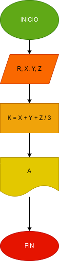

# Programa para calcular notas

## Hacer un programa que lea cuatro datos: El codigo de un estudiante y las notas de los tres previos de una materia cualquiera e imprima la nota final de la materia, junto con el codigo del estudiante

 